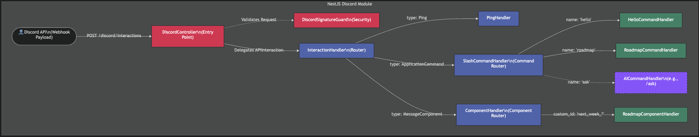

[text](src/discord/handlers/slash-command.handler.ts) [text](src/discord/handlers/roadmap-component.handler.ts) [text](src/discord/handlers/roadmap-command.handler.ts) [text](src/discord/handlers/ping.handler.ts) [text](src/discord/handlers/interaction.handler.ts) [text](src/discord/handlers/hello-command.handler.ts) [text](src/discord/handlers/component.handler.ts) [text](src/discord/handlers)

# Message components

Created all message components in controller and verified its working.
Created a blue print to refactor it follwoing SOLID principles
Based on that, refactored the component controller
And created individual handlers to ensure single responsibility of each component.
Finally, verified its working

